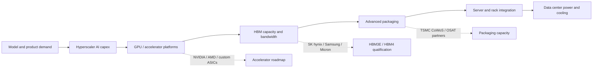
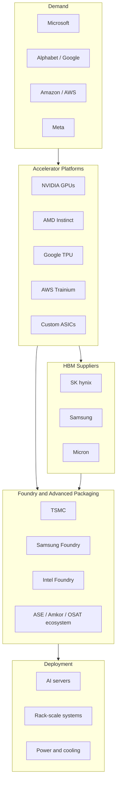
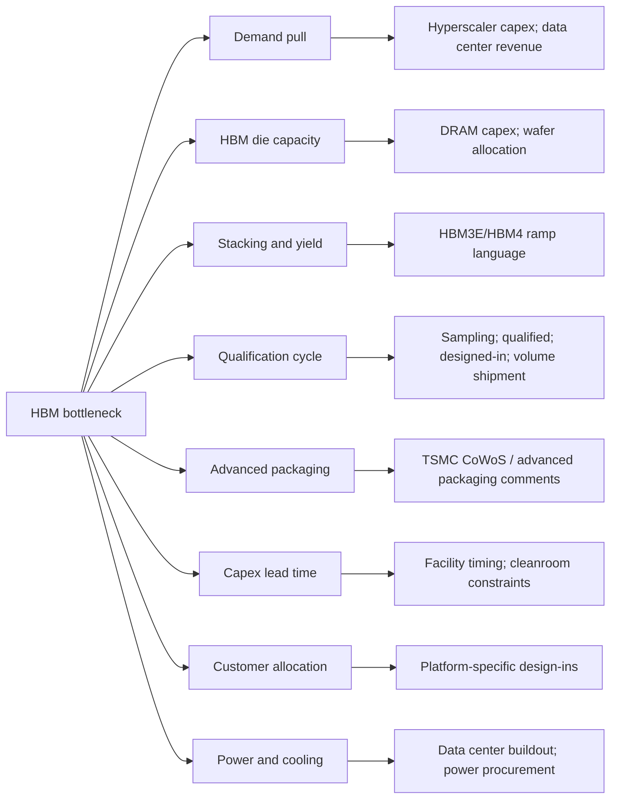

# Figure Drafts

These are draft figures for the portfolio memo. They are designed to explain structure and bottlenecks, not to imply fake numerical precision.

## Figure 1: AI Scaling Demand Chain

Question answered: How does AI model demand turn into an HBM and infrastructure bottleneck?

One-sentence takeaway: AI scaling is constrained by a linked infrastructure chain, not by GPUs alone.

## Figure 2: HBM Supply Chain Map

Question answered: Which actors control which part of the HBM bottleneck?

One-sentence takeaway: HBM supply depends on coordination across customers, accelerator platforms, memory vendors, and packaging capacity.

## Figure 3: Bottleneck Decomposition

Question answered: What does "HBM shortage" actually mean?

One-sentence takeaway: A credible HBM memo should decompose the bottleneck instead of treating it as one vague shortage.

## Figure 4: Public Signal Dashboard Mock

Question answered: What should a lightweight public-signal monitoring product track?

```mermaid
flowchart TB
    Dashboard["Quarterly Public Signal Dashboard"]

    Dashboard --> A["Demand"]
    Dashboard --> B["Accelerators"]
    Dashboard --> C["HBM Supply"]
    Dashboard --> D["Packaging"]
    Dashboard --> E["Deployment"]
    Dashboard --> F["Risk Label"]

    A --> A1["Hyperscaler capex guidance"]
    A --> A2["Cloud AI revenue commentary"]

    B --> B1["NVIDIA Data Center revenue"]
    B --> B2["AMD Data Center revenue"]
    B --> B3["Accelerator memory specs"]

    C --> C1["HBM3E/HBM4 shipment language"]
    C --> C2["Supplier qualification status"]

    D --> D1["TSMC advanced packaging comments"]
    D --> D2["OSAT capacity expansion"]

    E --> E1["AI server shipment estimates"]
    E --> E2["Power and cooling constraints"]

    F --> F1["Easing"]
    F --> F2["Stable tightness"]
    F --> F3["Worsening"]
    F --> F4["Unclear"]
```

One-sentence takeaway: The portfolio product should classify bottleneck direction from public signals, not pretend to estimate exact HBM allocation.

## Figure 5: Risk Matrix

Question answered: What would change the bottleneck thesis?

| Demand Strength | Supply Response | Scenario | Interpretation |
|---|---|---|---|
| Accelerating | Slow | Bottleneck worsens | HBM, packaging, and data center constraints remain tight |
| Strong | Moderate | Bottleneck persists | Supply growth is absorbed by AI demand and higher HBM intensity |
| Stable or moderating | Fast | Bottleneck eases | Multiple qualified suppliers and packaging expansion reduce pressure |
| Slowing | Fast | Overbuild risk | Supply arrives after demand slows, reviving memory-cycle downside |

One-sentence takeaway: The question is whether supply response catches demand before memory intensity and deployment demand move higher.

